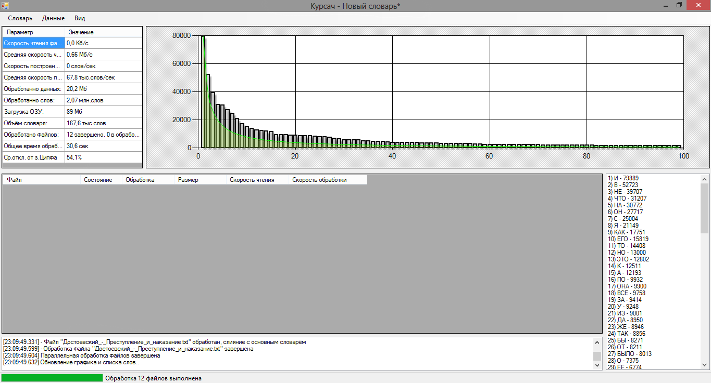
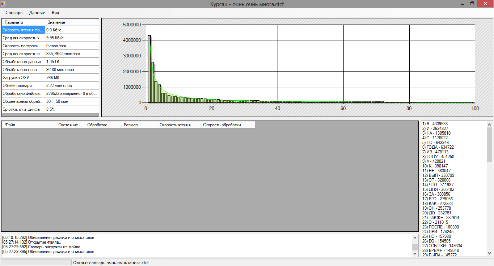

# Курсовая работа

Построение частотного словаря и проверка закона Ципфа с использованием MapReduce

## Задание

Написать программу, которая обрабатывает текстовые файлы, пополняя базу данных встречающихся слов, сохраняя частоту встречаемости слов. По накопленному словарю построить гистограмму встречаемости слов разной длины и проверить закон Ципфа, только необходимо производить анализ текстового файла размером как минимум 100GB с использованием MapReduce. Также необходимо использовать все ядра CPU и использовать CUDA. MapReduce—Википедия (http://ru.wikipedia.org/wiki/MapReduce) MapReduce или подсчеты за пределами возможностей памяти и процессора (попробую без зауми) (http://habrahabr.ru/blogs/algorithm/103467) MapReduce: более продвинутые примеры, попробуем без зауми (http://habrahabr.ru/blogs/algorithm/103490) Mars: A MapReduce CUDA Framework (http://www.cse.ust.hk/gpuqp/Mars.html)

## Описание

В качестве словаря используется префиксное (не суффиксное) дерево, вершинами которого выступают буквы. Слово строится начиная от корня к вершине. Так же вершина хранит в себе информацию о количестве слова. Таким образом используется минимальное количество памяти и наиболее быстрый алгоритм поиска слова в словаре.
В качестве входных данных могут использоваться txt файлы или статьи из википедии. Программа поддерживает паралельную обработку случайных статей из википедии. Первым запросом приложение получает список случайных статей, далее же происходят параллельные обращения для получения полного текста каждой из них и их обработка, а именно добавление в дерево каждого слова.

## Пример работы програмы

## Выводы

По результатам обработки можно сделать следующие выводы:

> Среднее отклонение от закона Ципфа – около 8,5%.
>
> Результат выявляется уже для 5 тысяч обработанных статей.
>
> Среди обработанных 92 миллионов слов – около 2 миллионов – уникальные.
> 
> Большая часть времени уходит на загрузку данных из интернета – около 98%.
> 
> Средний размер статьи Википедии – 332 слова / 3,93 КБ.
>
> Средняя длина слова – 6 букв.
